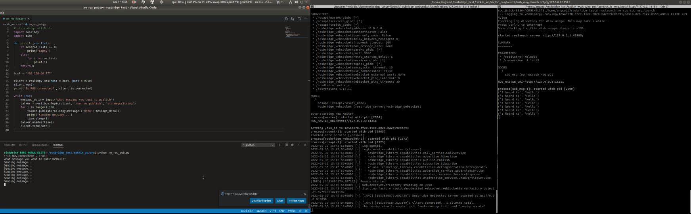

# Example: publish and suscribe

#### Terminal 1:
```bash
cd rosbridge_test
source docker_run.bash
source catkin_make.sh
source environment.sh
roslaunch rosbridge_server rosbridge_websocket.launch
```

#### Terminal 2:
```bash
cd rosbridge_test
source docker_join.bash
source environment.sh
roslaunch no_ros sub_msg.launch
```

#### Terminal 3:
```bash
cd rosbridge_test/catkin_ws/src/
python no_ros_pub.py
```
#### If you are successful, you will see the following image

